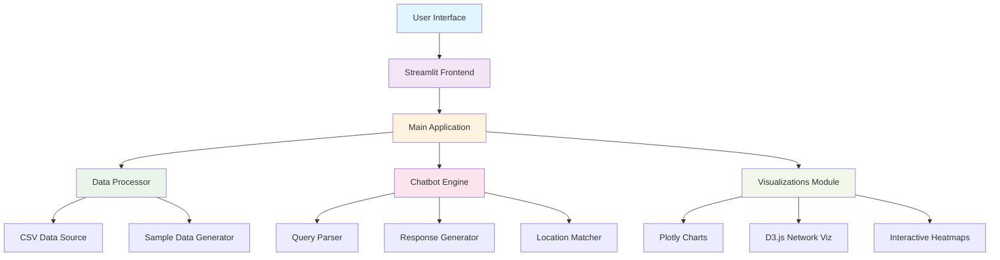
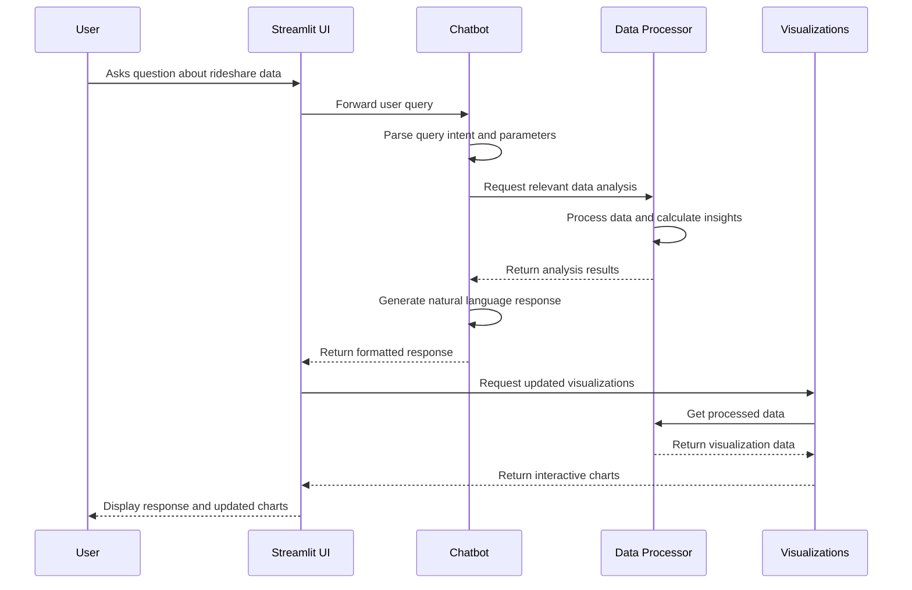
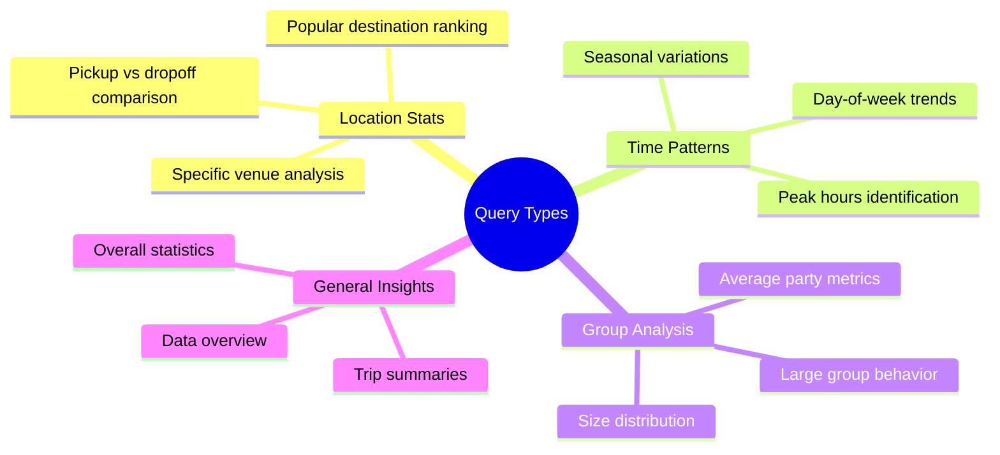
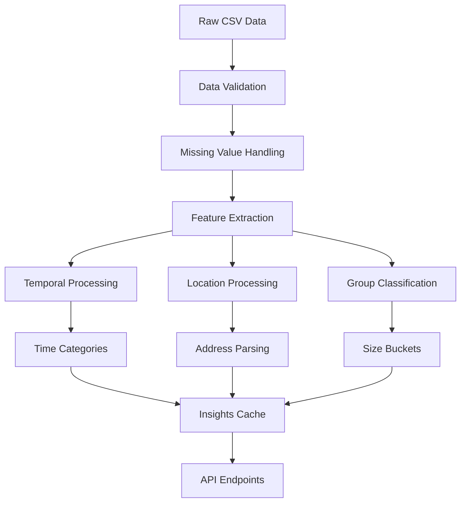

# Fetii AI Assistant

A sophisticated Streamlit-based analytics dashboard and conversational AI system for analyzing Austin rideshare patterns and trip data.

## Overview

Fetii AI Assistant combines advanced data processing, interactive visualizations, and natural language query processing to provide insights into Austin rideshare operations. The system processes trip data to identify patterns, peak hours, popular locations, and group size distributions while offering an intuitive chat interface for data exploration.

## Architecture



## System Components

### Core Modules

```mermaid
classDiagram
    class DataProcessor {
        +load_and_process_data()
        +get_quick_insights()
        +get_location_stats()
        +get_time_patterns()
        +query_data()
        -_clean_data()
        -_extract_temporal_features()
        -_extract_location_features()
    }
    
    class FetiiChatbot {
        +process_query()
        +get_conversation_history()
        +clear_history()
        -_parse_query()
        -_generate_response()
        -_fuzzy_search_location()
    }
    
    class Visualizations {
        +create_visualizations()
        +create_hourly_chart()
        +create_group_size_chart()
        +create_time_heatmap()
        +create_distance_analysis()
    }
    
    DataProcessor ||--|| FetiiChatbot : uses
    DataProcessor ||--|| Visualizations : feeds data
    FetiiChatbot ||--|| Visualizations : requests charts
```

## Data Flow



## Features

### 1. Data Processing Engine
- **CSV Data Loading**: Robust parsing of rideshare trip data
- **Data Cleaning**: Handles missing values, invalid entries, and data standardization
- **Feature Engineering**: Extracts temporal patterns, location categories, and group classifications
- **Real-time Analytics**: Calculates insights on-demand for responsive user experience

### 2. Conversational AI Interface
- **Natural Language Processing**: Understands complex queries about locations, times, and patterns
- **Context-Aware Responses**: Maintains conversation history and provides relevant follow-up suggestions
- **Fuzzy Matching**: Intelligent location search with partial name matching
- **Query Intent Recognition**: Identifies whether users want statistics, comparisons, or general information

### 3. Interactive Visualizations
- **Peak Hour Analysis**: Dynamic bar charts showing trip distribution across hours
- **Group Size Patterns**: Pie charts and breakdowns of passenger group sizes
- **Location Popularity**: Horizontal bar charts of top pickup and dropoff spots
- **Time Heatmaps**: Day-hour heatmaps revealing temporal patterns
- **Network Diagrams**: D3.js-powered flow visualizations showing location connections

### 4. Modern UI/UX Design
- **Clean Interface**: Professional design with Inter font family and optimized spacing
- **Responsive Layout**: Adapts to different screen sizes and devices
- **Real-time Updates**: Live data refresh and interactive chart updates
- **Accessibility**: High contrast ratios and semantic markup for screen readers

## Query Types Supported

The chatbot recognizes and responds to several query patterns:



## Technical Implementation

### Query Processing Pipeline


### Data Processing Workflow



## File Structure

```
fetii-ai/
├── main.py                 # Main Streamlit application
├── data_processor.py       # Core data processing logic
├── chatbot_engine.py       # Natural language processing
├── visualizations.py       # Chart generation and styling
├── config.py              # Configuration and constants
├── utils.py               # Utility functions
├── requirements.txt       # Python dependencies
└── README.md             # This documentation
```

## Key Technologies

- **Streamlit**: Web application framework for rapid prototyping
- **Plotly**: Interactive visualization library with modern styling
- **D3.js**: Advanced network and flow diagram generation
- **Pandas**: Data manipulation and analysis
- **NumPy**: Numerical computing for statistical operations
- **Regular Expressions**: Pattern matching for query parsing

## Installation & Setup

```bash
# Clone the repository
git clone <repository-url>
cd fetii-ai

# Install dependencies
pip install -r requirements.txt

# Run the application
streamlit run main.py
```

## Configuration Options

The system provides extensive configuration through `config.py`:

- **Color Schemes**: Modern blue-based palette with accessibility considerations
- **Chart Settings**: Consistent styling across all visualizations
- **Query Patterns**: Customizable regex patterns for intent recognition
- **Data Thresholds**: Adjustable limits for analysis and filtering
- **UI Components**: Font families, spacing, and responsive breakpoints

## Data Schema

Expected CSV format:
```
Trip ID, Booking User ID, Pick Up Latitude, Pick Up Longitude, 
Drop Off Latitude, Drop Off Longitude, Pick Up Address, 
Drop Off Address, Trip Date and Time, Total Passengers
```

## Advanced Features

### Fuzzy Location Matching
The system implements intelligent location search that handles:
- Exact name matches
- Partial string matching
- Word-based similarity
- Common abbreviation recognition

### Context-Aware Responses
Chatbot responses adapt based on:
- Previous conversation history
- Query complexity level
- Available data completeness
- User expertise inference

### Performance Optimizations
- Data caching for repeated queries
- Efficient pandas operations
- Lazy loading of visualizations
- Memory-conscious data processing

## Future Enhancements

- Machine learning predictions for trip demand
- Real-time data streaming integration
- Advanced geographic clustering
- Multi-city dataset support
- Export capabilities for reports
- API endpoints for external integration

## Contributing

When contributing to this project:
1. Follow the established code structure and naming conventions
2. Update visualizations to maintain consistent styling
3. Test query patterns thoroughly with various input formats
4. Ensure responsive design principles are maintained
5. Document any new configuration options

## License

This project is designed for analytics and insights generation. Ensure compliance with data privacy regulations when processing real rideshare data.
